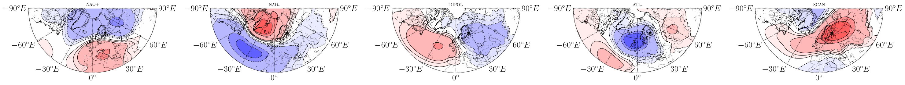
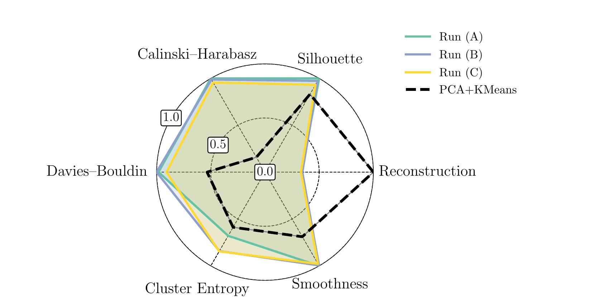
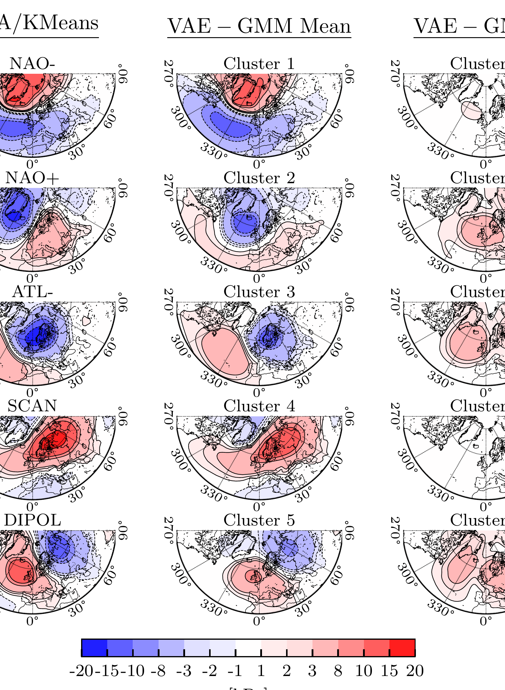

# VAE-GMM — Weather Regime Discovery with a Variational Autoencoder


Unsupervised discovery of North Atlantic circulation regimes from sea-level pressure fields,
using a Variational Autoencoder with a Gaussian Mixture prior in latent space (VAE-GMM),
implemented in PyTorch Lightning.



*The five regimes recovered by the model, without any labels: NAO+, NAO−, DIPOL, ATL− and SCAN.
Composites of mean sea-level pressure anomalies over the North Atlantic (DJFM, 6-hourly, detrended).*

## The problem

Mid-latitude weather does not vary smoothly — it lingers in a handful of recurring large-scale
circulation patterns ("regimes") that persist for days and steer storm tracks, cold spells and
blocking events. Identifying these regimes objectively matters for sub-seasonal forecasting and
for understanding how circulation responds to a warming climate.

The established approach is linear: reduce the pressure fields with PCA, then cluster the leading
components with k-means. It is fast and reproducible, but it assumes regimes are linearly separable
blobs of equal shape, and it assigns every day to exactly one regime — even days that sit halfway
between two.

This project asks whether a nonlinear, probabilistic model does better: an autoencoder learns a
14-dimensional latent representation, while a Gaussian mixture is trained *jointly* in that latent
space, so the representation is shaped by the clustering objective rather than fixed beforehand.
Each day receives a probability distribution over regimes instead of a hard label.

## Why VAE-GMM instead of PCA + k-means?

This was the central design question, and the honest answer is a trade-off rather than a clean win.



*Three VAE-GMM runs with different random seeds (coloured, nearly indistinguishable) against the
PCA/k-means baseline (dashed). Axes are normalised so that further out is better.*

The VAE-GMM improves every clustering-quality metric — silhouette, Calinski–Harabasz,
Davies–Bouldin and cluster entropy — but pays for it with roughly **twice the reconstruction loss**
of the baseline at the same latent dimension. That is expected, not a defect: the model is
explicitly optimised for multiple objectives, and enforcing a structured latent space costs
reconstruction detail because the encoder projects samples onto a clustering structure instead of
reproducing them faithfully.

Whether that trade is worth making depends on the application. For regime identification it is,
because the quantities of interest are the cluster structure and the soft assignments — not
pixel-accurate reconstruction of a pressure field that already exists.

There is a second, structural reason. Because the mixture is trained *jointly* with the encoder
rather than fitted to a frozen representation, the latent space stays differentiable and can be
extended with a supervised head that predicts a target variable — surface temperature or
precipitation, say — directly from the same representation that defines the regimes. Regime
discovery and impact prediction then share one model instead of being bolted together after the
fact. This follows the approach of Spuler et al. (2024) and was explored briefly in the underlying
thesis; **that predictor is not part of this repository.**

Metrics over 100 runs with different random seeds (validation set):

| Metric | VAE-GMM (mean ± std) | vs. PCA/k-means |
|---|---|---|
| Silhouette score | 0.123 ± 0.004 | better |
| Calinski–Harabasz | 2957 ± 7 | better |
| Davies–Bouldin | 1.590 ± 0.003 | better |
| Cluster entropy | 1.607 ± 0.001 | better |
| Reconstruction loss | 0.1542 ± 0.0008 | ~2× worse |

The small standard deviations are the point of the table: the result is reproducible across seeds,
not a lucky run.

## Results



*Left: PCA/k-means baseline composites. Middle: VAE-GMM cluster composites averaged over 100 runs.
Right: standard deviation across those 100 runs.*

The recovered regimes match the circulation patterns established in the literature and can be
mapped one-to-one onto the baseline regimes. The third column quantifies how stable each pattern
is: NAO− and SCAN are recovered almost identically in every run, while the remaining three show
more spatial variability — a form of uncertainty the deterministic baseline cannot express at all.

## Data

**The training data is not included in this repository** and cannot be redistributed here.

The model was trained on mean sea-level pressure (MSLP) anomalies over the North Atlantic:

| Property | Value |
|---|---|
| Variable | MSLP anomalies |
| Grid | 1°, 61 × 181 grid points (North Atlantic sector) |
| Season | DJFM |
| Resolution | 6-hourly |
| Preprocessing | detrended, area-weighted by `cos(latitude)` |

Comparable data can be obtained from ERA5 via the [Copernicus Climate Data Store](https://cds.climate.copernicus.eu/).
Any NetCDF file with an `MSL` variable on `(time, lat, lon)` and a matching `input_shape` in
`ModelConfig` will work.

## Installation

```bash
git clone https://github.com/jonashuegle/vae_gmm.git
cd vae_gmm
pip install -e .
```

This installs everything needed to train the model. Two optional extras are available:

| Extra | Command | Needed for |
|---|---|---|
| `analysis` | `pip install -e ".[analysis]"` | map plotting — `plotting.py`, `loaders.py`, `pattern_*.py` |
| `scan` | `pip install -e ".[scan]"` | Ray Tune hyperparameter scan |

The `analysis` extra pulls in [Basemap](https://matplotlib.org/basemap/), which is deprecated
upstream in favour of [Cartopy](https://scitools.org.uk/cartopy/). It is kept here because the
plotting code was written against it; porting `plotting.py` to Cartopy is the obvious next step and
is deliberately out of scope for now. Training and the test suite do not depend on it.

## Usage

Paths are configured through environment variables:

```bash
export DATA_PATH=./data/slp.nc     # NetCDF file used for training
export LOG_DIR=./logs              # base directory for checkpoints and TensorBoard logs
```

Train:

```bash
vae-gmm-train --max_epochs 400 --seed 42        # new run
vae-gmm-train --resume --seed 42                # resume the latest version
vae-gmm-train --version 3 --max_epochs 300      # a specific version
vae-gmm-train --find-lr                         # learning rate finder, no training
```

Checkpoints and TensorBoard logs are written to `$LOG_DIR/<experiment>/version_X/`, where
`<experiment>` comes from `DataConfig.experiment`.

Post-training analysis (requires the `analysis` extra):

```python
import torch
from vae_gmm.loaders import ClusteringLoader

CL = ClusteringLoader(
    log_dir="./logs",
    experiment="Experiment_",
    version="0",
    nc_path="./data/slp.nc",
    device=torch.device("cuda" if torch.cuda.is_available() else "cpu"),
)

CL.auto_map_by_correlation()  # match clusters to reference regimes by spatial correlation
CL.plot_model_composition()
CL.plot_tsne(use_kmeans=False)
periods_df = CL.cluster_periods()
```

Training was run on the DKRZ Levante cluster, one GPU per job. Cluster-specific SLURM scripts are
not included; pass the environment through with
`sbatch --export=ALL,DATA_PATH=…,LOG_DIR=… your_job.slurm …`.

## How it works

Training runs in four phases, controlled by `TrainingSetup`:

1. **VAE pretraining** — reconstruction and global KL divergence only; the latent space is shaped
   before any clustering pressure is applied.
2. **Cluster initialisation** — k-means++ on the encoded training data seeds the mixture
   parameters (`mu_c`, `log_var_c`, `pi`) at `kmeans_init_epoch`.
3. **GMM warmup** — the mixture loss terms are annealed in linearly, so the latent space is not
   torn apart by a suddenly dominant clustering objective.
4. **Relaxation** — loss weights are gradually reduced to let the model settle.

Loss weights follow annealing schedules rather than fixed values (`get_annealing_factor`); the
KL weight additionally adapts to the validation reconstruction loss. Hyperparameters were selected
with a multi-objective Ray Tune scan using a Pareto front over reconstruction and clustering
quality, instead of manually weighting the objectives into a single score.

## Repository layout

| Path | Contents |
|---|---|
| `vae_gmm/config.py` | all configuration dataclasses (`ModelConfig`, `TrainingConfig`, `TrainingSetup`, `DataConfig`, `HardwareConfig`) |
| `vae_gmm/VAE_GMM.py` | encoder, decoder, Gaussian mixture, losses, metrics |
| `vae_gmm/dataset.py` | NetCDF dataset and Lightning `DataModule` |
| `vae_gmm/training.py` | training entry point |
| `vae_gmm/loaders.py` | `ClusteringLoader` — load a trained model, map and plot clusters |
| `vae_gmm/parameter_scan.py` | Ray Tune multi-objective scan |
| `vae_gmm/plotting.py`, `pattern_taylor.py`, `pattern_reference_manager.py`, `tb_utils.py` | analysis and visualisation |
| `tests/` | unit tests — run without GPU or training data |

## Tests

```bash
pip install -e ".[dev]"
pytest
```

The test suite deliberately avoids testing a trained model, which would be slow and flaky. It
covers what can be checked deterministically: annealing schedules against hand-computed values,
encoder/decoder shape invariants, the normalisation path on a synthetic NetCDF file, and a single
training step on generated data.

## Known limitations

These were surfaced while building the test suite and are documented rather than patched, since
they never occur at the training `batch_size` of 400 and fixing them would change model behaviour
that cannot be re-validated without the original data.

- **Minimum batch size.** Several components assume batches larger than ~30 samples: `BatchNorm1d`
  needs at least 2, the k-NN latent metrics (`compute_local_density`, `compute_latent_smoothness`)
  use `k=10`, and the t-SNE logging uses `perplexity=30`. On very small batches these raise instead
  of degrading gracefully. The smoke test therefore runs on a large enough synthetic batch.
- **Leap-year episode durations.** `ClusteringLoader.cluster_periods` computes regime durations as
  wall-clock differences between timestamps. Because the data uses a `noleap` calendar, an episode
  spanning 28 Feb → 1 Mar of a leap year is counted one day too long.

## Background

This work was carried out as a Master's thesis in physics. The regime definitions follow
Crasemann et al. (2017); the VAE-GMM architecture is adapted from Spuler et al. (2024) and modified
to handle larger fields.
